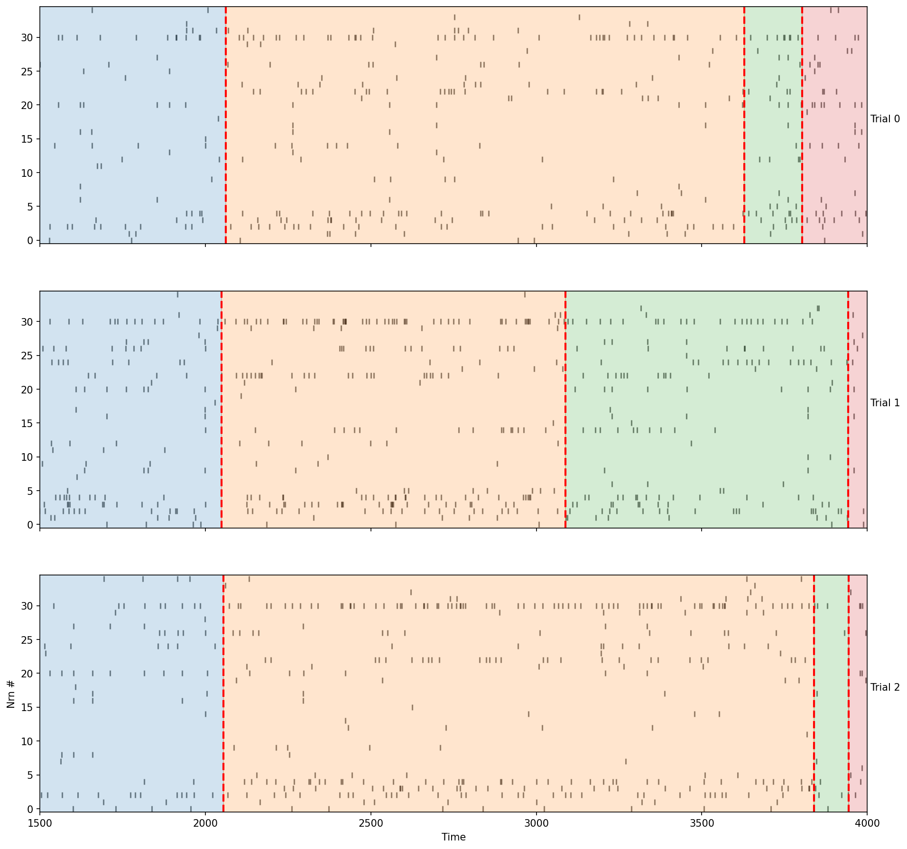
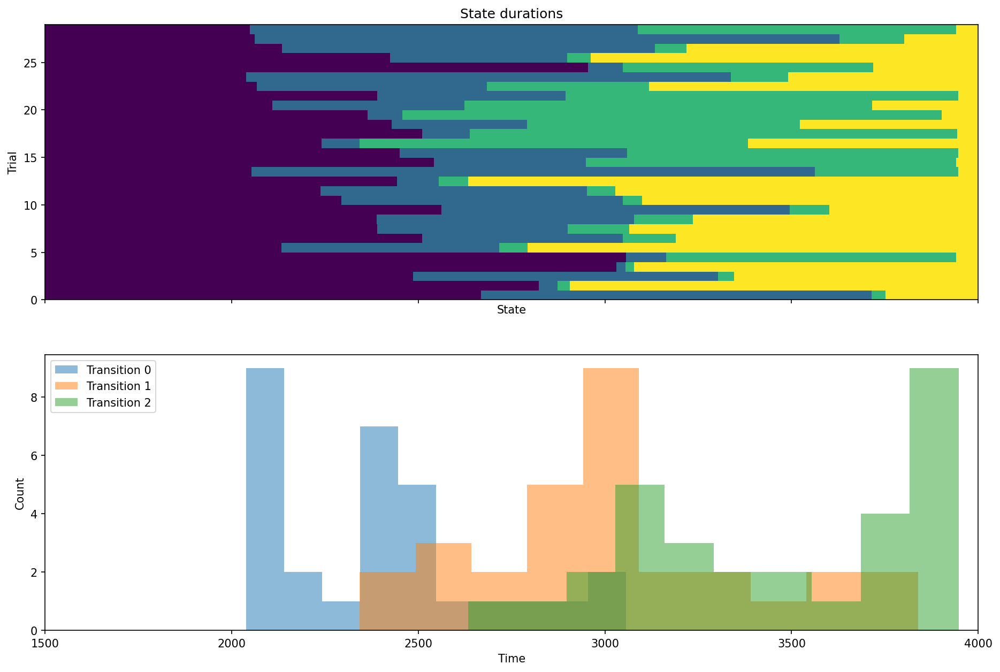
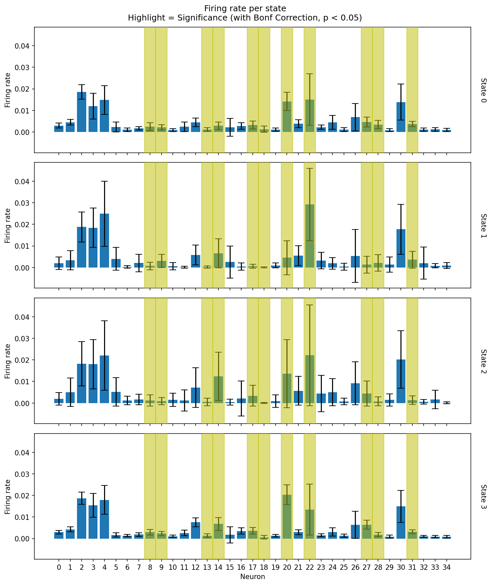
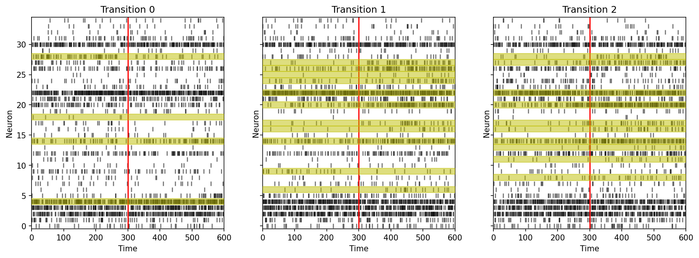

# Summary

Analyzing complex biological data, particularly time-series data from neuroscience experiments, often requires sophisticated statistical modeling to identify significant changes in system dynamics. Several decades of research has emphasized that the dynamics of neural activity may show sharp changes accurately captured by models detecting state transitions such as Hidden aMarkov Models and changepoint models [@Seidemann1994; @Jones2007; @Saravani2019]. `pytau` is a Python software package designed to perform streamlined, batched inference for changepoint models across different parameter grids and datasets. It provides tools to efficiently query and analyze the results from sets of fitted models, facilitating the study of dynamic processes in biological systems, such as neural ensemble activity in response to stimuli. The package integrates with PyMC3 for Bayesian inference of these models (providing estimates of uncertainty in inference which are critical for noisy datasets usually with small sample sizes and low channel counts common in neuroscience) and provides utilities for data preprocessing, model fitting, and result visualization. The package has been successfully used in published research [@Mahmood2023; @Flores2023] and is currently being utilized in several ongoing studies [@MazzioInPrep; @BaasThomasInPrep; @MahmoodInPrep; @CaliaBoganInPrep].

# Statement of need

Understanding how neural populations encode information often involves analyzing activity changes over time, potentially across different experimental conditions, parameters, or subjects. Fitting and comparing complex models like Bayesian changepoint models across numerous datasets or parameter settings can be computationally intensive and logistically challenging. There is a need for tools that streamline this process, enabling researchers to efficiently apply these models in batch, manage the results, and compare outcomes across conditions. `pytau` aims to fill this gap by providing a modularized pipeline specifically for fitting and analyzing changepoint models applied to neuroscience data, enabling efficient comparisons and analysis. This need is demonstrated by the tool's adoption in recent studies examining neural dynamics in taste processing [@Mahmood2023] and taste aversion learning [@Flores2023].

The package offers several key advantages:

1. **Batch processing**: Automates the fitting of models across multiple datasets and parameter configurations
2. **Database management**: Organizes and tracks model fits for easy retrieval and comparison
3. **Visualization tools**: Provides specialized plotting functions for changepoint model results, including:
   - Raster plots with overlaid changepoints
   - State-dependent firing rate visualizations
   - Transition-aligned activity plots
   - Model comparison visualizations
4. **Flexible model specification**: Supports various changepoint model configurations for different analysis needs
5. **Statistical analysis**: Includes tools for significance testing of state-dependent neural activity, such as:
   - ANOVA-based detection of neurons with significant state-dependent firing
   - Pairwise t-tests for transition-triggered neural activity
   - Cross-trial analysis of state transitions



These features make `pytau` particularly valuable for neuroscientists studying state transitions in neural activity, such as taste processing, decision-making, or learning paradigms.

# Implementation and architecture

`pytau` is implemented in Python and built on several key libraries including NumPy, SciPy, PyMC3, and Matplotlib [@numpy; @pymc3]. The package is organized into several modules:

1. **changepoint_model.py**: Contains model definitions for various changepoint models including Poisson and Gaussian models for neural data
2. **changepoint_io.py**: Handles data loading, preprocessing, and result storage through the `FitHandler` and `DatabaseHandler` classes
3. **changepoint_analysis.py**: Provides tools for analyzing fitted models, including significance testing and visualization
4. **changepoint_preprocess.py**: Contains functions for data preprocessing, binning, and transformations
5. **utils/**: Contains utility functions for plotting, data handling, and batch processing

The core workflow in `pytau` involves:

1. Loading neural data (typically spike trains) using the `EphysData` class
2. Preprocessing the data for model fitting with functions from `changepoint_preprocess`
3. Defining and fitting changepoint models using PyMC3-based implementations in `changepoint_model`
4. Storing results in a queryable database managed by `DatabaseHandler`
5. Analyzing and visualizing the results with functions from `changepoint_analysis`

The mathematical foundation of the package is Bayesian changepoint detection. For a time series $X = \{x_1, x_2, ..., x_T\}$, we model the data as having $K$ distinct states with transitions at times $\tau = \{\tau_1, \tau_2, ..., \tau_{K-1}\}$. The emission distribution within each state $k$ is parameterized by $\theta_k$:

$$p(x_t | \theta_k) \textrm{ for } \tau_{k-1} < t \leq \tau_k$$

For neural spike train data, the package implements Poisson emission models:

$$x_t \sim \textrm{Poisson}(\lambda_k) \textrm{ for } \tau_{k-1} < t \leq \tau_k$$

Where $\lambda_k$ represents the firing rate in state $k$.

## Fitting Methods

`pytau` employs advanced Bayesian inference techniques to fit changepoint models. The package utilizes both Automatic Differentiation Variational Inference (ADVI) [@kucukelbir2016automatic] and Markov Chain Monte Carlo (MCMC) methods, including the No-U-Turn Sampler (NUTS) [@hoffman2011no], to perform efficient and accurate model fitting. These methods are integrated through PyMC3, allowing for robust estimation of model parameters and uncertainty quantification.

The use of ADVI provides a fast approximation to the posterior distribution, making it suitable for initial exploration and parameter tuning. For more precise inference, `pytau` leverages the NUTS sampler, a variant of MCMC that adapts the step size and trajectory length during sampling, ensuring efficient exploration of the parameter space.

A key feature of `pytau` is the creation of states through the stacking of sigmoid functions. This approach allows for continuous exploration of parameters, enabling the detection of subtle changes in neural activity. By modeling state transitions with sigmoid functions, the package captures the gradual nature of neural dynamics, providing a more nuanced understanding of state-dependent processes.

# Example usage

Below is a simple example of using `pytau` to fit a changepoint model to neural data:

```python
from pytau.changepoint_io import FitHandler

# Initialize fit handler
fh = FitHandler(
    data_dir='/path/to/data',
    taste_num=1,
    region_name='GC',
    experiment_name='example_experiment'
)

# Set preprocessing parameters
fh.set_preprocess_params(
    time_lims=[0, 2000],  # Time window in ms
    bin_width=10,         # Bin width in ms
    data_transform=None   # No transformation
)

# Set model parameters
fh.set_model_params(
    states=3,             # Number of states to fit
    fit=5000,             # ADVI iterations
    samples=1000,         # Number of posterior samples
    model_kwargs={}       # Additional model parameters
)

# Run the full pipeline
fh.load_spike_trains()
fh.preprocess_data()
fh.create_model()
fh.run_inference()
fh.save_fit_output()
```

After fitting, the results can be analyzed using the `PklHandler` class:

```python
from pytau.changepoint_analysis import PklHandler

# Load fitted model
pkl_handler = PklHandler('/path/to/saved/model.pkl')

# Access model components
tau = pkl_handler.tau  # Changepoint times
firing = pkl_handler.firing  # Firing rate analysis

# Analyze significant neurons
significant_neurons = firing.anova_significant_neurons

# Access transition analysis data
transition_snippets = firing.transition_snips
pairwise_significant = firing.pairwise_significant_neurons

# Visualize the results (using functions from pytau.utils.plotting)
import matplotlib.pyplot as plt
from pytau.utils.plotting import plot_changepoint_raster, plot_state_firing_rates

# Plot spike rasters with changepoint overlays
fig, ax = plt.subplots(figsize=(10, 6))
plot_changepoint_raster(pkl_handler.processed_spikes, pkl_handler.tau.scaled_mode_tau,
                        plot_lims=[0, 2000])

# Plot state-dependent firing rates
plot_state_firing_rates(pkl_handler.processed_spikes, pkl_handler.tau.scaled_mode_tau)
```





This example demonstrates the streamlined workflow for fitting a changepoint model to taste response data, analyzing the results, and visualizing the findings.

# Tutorials and documentation

For users interested in learning how to effectively use the `pytau` package, a series of tutorials are available in the `how_to` directory of the repository. These include:

1. **Jupyter notebooks**: Step-by-step walkthroughs demonstrating the package functionality with and without handlers. These notebooks cover various scenarios and use cases, providing a hands-on approach to learning.
2. **Example scripts**: Ready-to-run Python scripts showing how to fit models manually or using the `FitHandler`. These scripts serve as practical examples for users to understand the workflow and customize it for their needs.
3. **Test data**: Scripts to download test datasets for practicing with the package. This allows users to experiment with the package features without needing their own data initially.

These tutorials provide comprehensive guidance on various features and use cases of the package, helping users to get started quickly and efficiently with changepoint analysis of neural data.

# References to Recent Works

The `pytau` package has been utilized in several published and ongoing research projects in neuroscience, demonstrating its practical utility for analyzing neural dynamics:

- **Published Research**:
  - @Mahmood2023 used `pytau` to analyze the coupled dynamics between gustatory cortex and basolateral amygdala during taste processing, revealing coordinated state transitions across these regions.
  - @Flores2023 applied the package to investigate how taste experience enhances cortical response reliability during taste aversion learning.

- **Ongoing Research**:
  - @MazzioInPrep is using `pytau` to study cortical dynamics underlying learned and non-learned aversive behavior.
  - @BaasThomas2023 is investigating neural signals driving consummatory responses in rats.
  - @MahmoodInPrep is examining asymmetric interactions between basolateral amygdala and gustatory cortex during taste processing.
  - @CaliaBoganInPrep is analyzing taste-evoked intra-state dynamics in the gustatory cortex.
  - @RaymondInPrep is using inferred changepoints to align neural activity with free consumption behaviors in a rat model.

These applications demonstrate the versatility of `pytau` for analyzing state transitions in neural activity across different experimental paradigms and brain regions.

# Model types and features

`pytau` implements several types of changepoint models to accommodate different analysis needs:

1. **Single taste Poisson models**: For analyzing single-taste responses with Poisson emission distributions
   ```python
   # From changepoint_model.py
   single_taste_poisson(spike_array, states, **kwargs)
   ```

2. **Variable sigmoid models**: Models with learnable transition sharpness
   ```python
   # From changepoint_model.py
   single_taste_poisson_varsig(spike_array, states, **kwargs)
   ```

3. **Fixed sigmoid models**: Models with fixed transition sharpness
   ```python
   # From changepoint_model.py
   single_taste_poisson_varsig_fixed(spike_array, states, inds_span=1)
   ```

4. **All-taste models**: For analyzing responses across multiple stimuli
   ```python
   # From changepoint_model.py
   all_taste_poisson(spike_array, states, **kwargs)
   ```

5. **Dirichlet process models**: For automatically determining the number of states
   ```python
   # From changepoint_model.py
   single_taste_poisson_dirichlet(spike_array, max_states=10, **kwargs)
   ```

The package also provides tools for statistical analysis of fitted models, including:

1. **State-dependent firing rate analysis**:
   ```python
   # From changepoint_analysis.py
   get_state_firing(spike_array, tau_array)
   ```

2. **Significance testing**:
   ```python
   # From changepoint_analysis.py
   calc_significant_neurons_firing(state_firing, p_val=0.05)
   ```

3. **Transition analysis**:
   ```python
   # From changepoint_analysis.py
   get_transition_snips(spike_array, tau_array, window_radius=300)
   calc_significant_neurons_snippets(transition_snips, p_val=0.05)
   ```

4. **Visualization tools**:
   ```python
   # From utils/plotting.py
   plot_changepoint_raster(spike_array, tau, plot_lims=None)
   plot_changepoint_overview(tau, plot_lims)
   plot_aligned_state_firing(spike_array, tau, window_radius=300)
   plot_state_firing_rates(spike_array, tau)
   plot_elbo_history(fit_model, final_window=0.05)
   ```



These visualization and analysis functions enable researchers to:
  - Examine neural activity with overlaid changepoints
  - Visualize the distribution of changepoints across trials
  - Analyze neural activity aligned to state transitions
  - Compare firing rates across different states
  - Identify neurons with significant state-dependent activity
  - Detect neurons that respond significantly to state transitions

# Comparison with existing tools

Several tools exist for changepoint detection, including:

1. **ruptures** [@ruptures]: A Python package for offline change point detection
2. **bayesloop**: A probabilistic programming framework for time series analysis
3. **PyChange**: A Python package for change point detection in time series
4. **Bayesian online changepoint detection** [@adams2007bayesian; @fearnhead2007line]: Methods for online detection of changepoints

`pytau` differs from these tools in its specific focus on neuroscience applications, particularly for analyzing neural ensemble data across multiple experimental conditions. It provides specialized functionality for:

1. Handling multi-trial, multi-neuron spike train data
2. Batch processing across parameter grids
3. Database management for model comparison
4. Specialized visualization for neural data
5. Statistical analysis of state-dependent neural activity

While general-purpose changepoint detection tools are valuable, `pytau` addresses the specific needs of neuroscientists analyzing state transitions in neural population activity.

# Acknowledgements

We acknowledge contributions from collaborators and support from the Katz Lab during the development of this project. Special thanks to the PyMC development team for providing the Bayesian modeling framework that powers the core functionality of `pytau`.

# References
