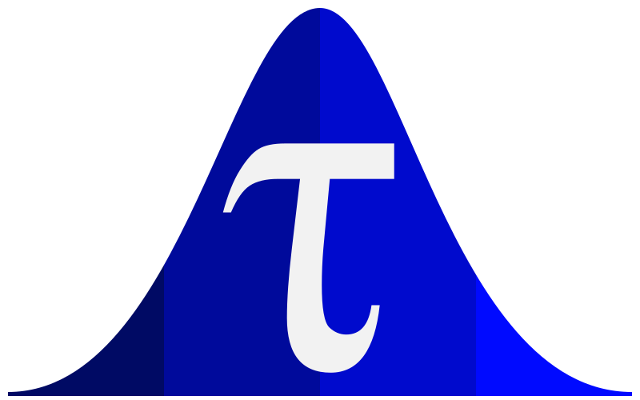

<div align="center">
  
  <h1>PyTau</h1>
  <p><strong>Powerful Changepoint Detection for Neural Data</strong></p>

  [](https://joss.theoj.org/papers/e3e3d9ce5b59166cef17ee7e9bb9f53c)
  [](https://results.pre-commit.ci/latest/github/abuzarmahmood/pytau/master)
  [](https://github.com/abuzarmahmood/pytau/actions/workflows/pytest_workflow.yml)
</div>

## 🚀 What is PyTau?

PyTau is a Python package for detecting state changes in time series data using Bayesian changepoint models. While originally developed for neural data analysis, the methods are applicable to any sequential data where identifying state transitions is important.

### Applications

**Neuroscience** (primary focus):
- Detect when neurons change their firing patterns in response to stimuli or behavioral events
- Identify the number and timing of distinct neural states in an experiment
- Compare state transitions across different experimental conditions, brain regions, or subjects
- Quantify uncertainty in state transition timing using Bayesian inference

**General Time Series Analysis**:
- Event count data (e.g., coal mining disasters, accident rates)
- Continuous measurements (e.g., temperature, quality control metrics)
- Process monitoring and anomaly detection
- Economic and financial regime changes

See the [GeneralChangepointExamples notebook](pytau/how_to/model_notebooks/GeneralChangepointExamples.ipynb) for examples beyond neuroscience.

PyTau builds on PyMC to provide flexible, extensible models while offering a streamlined interface for batch processing and analysis of large-scale datasets.

## 📚 Documentation

[**Full API Documentation**](https://abuzarmahmood.github.io/pytau/)

For detailed usage examples, model descriptions, and advanced features, please refer to the [complete documentation](https://abuzarmahmood.github.io/pytau/).

## ⚡ Installation

### Install from PyPI (Stable Release)

```bash
pip install pytau
```

**Note:** The PyPI version (0.1.2) may not include the latest features. For the most up-to-date version, install from GitHub (see below).

### Install from GitHub (Latest Version)

```bash
# Create and activate conda environment
conda create -n "pytau_env" python=3.10 ipython notebook -y
conda activate pytau_env

# Clone repository
git clone https://github.com/abuzarmahmood/pytau.git
cd pytau

# Install in development mode
pip install -e .
```

### Optional Dependencies

PyTau supports several optional dependency groups for different use cases:

```bash
# Development dependencies (testing, linting, etc.)
pip install -e .[dev]

# Documentation dependencies
pip install -e .[docs]

# GUI dependencies
pip install -e .[gui]

# Install all optional dependencies
pip install -e .[all]
```

### Quick Start Example

After installation, download test data and explore the example notebooks:

```bash
cd pytau/how_to
bash scripts/download_test_data.sh
cd notebooks
jupyter notebook
```

**Note for Windows users:** If the download script fails, see the [Installation section in the documentation](https://abuzarmahmood.github.io/pytau/#windows-users) for manual download instructions.

For a minimal usage example, see the [documentation](https://abuzarmahmood.github.io/pytau/).

## 🧠 Key Features

- **Multiple Model Types**: Poisson models for spike counts, Gaussian models for continuous data, categorical models for discrete data, and Dirichlet process models for automatic state detection
- **Flexible Inference**: Support for both variational inference (ADVI) and MCMC sampling with multiple backends
- **Batch Processing**: Streamlined pipeline for fitting models across multiple datasets and conditions
- **Comprehensive Analysis**: Tools for state transition detection, cross-region correlation, and statistical testing
- **Flexible Data Handling**: Support for various data formats and preprocessing options

For detailed model descriptions and usage examples, see the [full documentation](https://abuzarmahmood.github.io/pytau/).

## 📖 Usage Overview

PyTau provides a flexible framework for changepoint detection with support for various data types and model configurations. The package includes:

- **Model Types**: Poisson models for spike count data, Gaussian models for continuous signals, and categorical models for discrete data
- **Inference Methods**: Fast variational inference (ADVI) and high-quality MCMC sampling
- **Data Formats**: Support for 1D-4D arrays representing different experimental designs
- **Pipeline Components**: Modular architecture for data preprocessing, model fitting, and batch processing

For complete details on available models, inference methods, data formats, and advanced features like parallelization, please refer to the [full documentation](https://abuzarmahmood.github.io/pytau/).

## 🤝 Contributing

We welcome contributions to PyTau! Please see the [CONTRIBUTING.md](CONTRIBUTING.md) file for guidelines on how to contribute to the project.

### Testing

To run the test suite locally:

```bash
pytest tests/
```

To generate a coverage report:

```bash
pytest --cov=pytau --cov-report=html tests/
```

For more details on testing and development workflows, see [CONTRIBUTING.md](CONTRIBUTING.md).

### Building Documentation Locally

To build and view the documentation locally:

```bash
# Install documentation dependencies
pip install -r requirements-docs.txt

# Serve documentation locally
mkdocs serve
```

The documentation will be available at `http://localhost:8000`.
